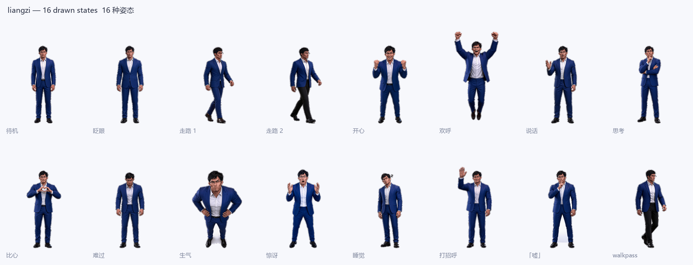
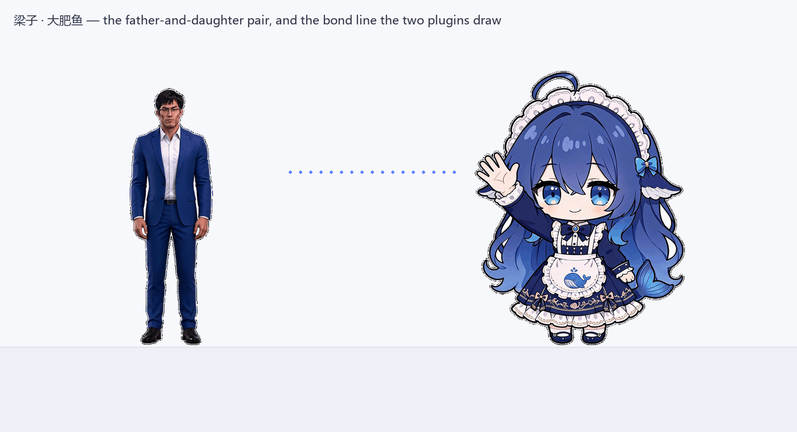

# 梁子 · Desktop Pet · Liangzi Desktop Pet

[](https://www.dsh.so/artifact/dsh-pet-liangzi/)

A **父亲** (father) that lives inside the DeepSeek Harness Web GUI. It stands on the
bottom edge of the window, breathes, blinks, strolls about with a real two-frame step, can be picked
up, thrown and dropped, turns to look at your pointer, does small things on its own, falls asleep if
you ignore it, says things out loud in Chinese with subtitles, and plays its own sound effects and
background music.

Every sound it makes is on its own switch, and **every asset ships inside this package** — no
network calls, no CDN, no build step, no external service.

> DeepSeek 创始人的动漫化身，沉稳可靠的父亲。会走动、会说话、能拖动；和「大肥鱼」同时安装时，父女俩会打招呼、搭话，还能演一段小剧场。





---

## What it does

| | |
|---|---|
| **16 drawn states** | 包括待机、眨眼、迈步（前脚）、迈步（过渡）、迈步（后脚）、开心、欢呼、说话、思考、比心、难过、生气、惊讶、睡觉、挥手、「嘘」的手势。 Every one is drawn from the original 梁子 artwork by image-to-image, so the face, outfit and palette stay exact — only the pose changes. |
| **It moves like a character** | A real **three-frame walk cycle** — contact, pass, contact — whose ground speed is *derived from the step cadence* rather than chosen freely, so the feet match the floor instead of skating. Plus idle **breathing**, **blinking** on an irregular cadence, hop, sway, nod, shake and squash-and-stretch. All of it CSS on top of the sprites, all of it respecting `prefers-reduced-motion`. |
| **Physics when you grab it** | Pick it up and it dangles against the direction you drag. Let go and it **falls under gravity**, lands with a squash and a spring, and throws a puff of sparkles if the drop was a long one. Its shadow shrinks and fades while it is in the air. |
| **Small things on its own** | Left alone it will 思考、「嘘」的手势、欢呼、比心、生气。 Each of those is a pose, a line and sometimes a little burst of particles. |
| **Reacts to you** | It turns to face your pointer when it comes near. Click it and it wakes up, reacts and says something. **Poke it three times quickly and it gets annoyed.** |
| **Two pets, together** | With both installed they do more than talk: they **walk over to stand beside each other**, turn to face whoever is speaking, **hand each other things** (a bowl of rice one way, a heart back), and perform the playlets side by side rather than from opposite corners. |
| **Voiced dialogue** | Every line is pre-rendered speech, not a beep. Speaking shows the subtitle in a bubble and switches the sprite to its talking state for exactly as long as the line runs. |
| **Sound effects** | Click, drag, greet, sparkle, heart, sleep and link cues, generated as one sound-effect group and picked per situation. |
| **Background music** | A calm instrumental loop written for this character. It starts only when you turn it on, and pauses automatically while the tab is in the background. |
| **Family link** | When [大肥鱼](https://github.com/bauerelizabeth07139/dsh-pet-dafeiyu) is installed too, the two pets notice each other: they greet, call out to each other while you work, wander over to keep each other company, and can perform **six father-and-daughter playlets** with directed, alternating turns. |

## The character

**梁子**是社区给梁文锋起的称号，出自网友做的那个「**滑动变祖器**」——三十一档，从「小难梁」一路到「梁祖」，「梁子」正好是中间那一档；它同时谐音「结梁子」。

他是**广东湛江吴川**人，父母都是镇上的小学老师，十七岁以高考状元进的浙大。所以这个插件里他讲的是**带广东口音的普通话**，语速偏慢、声音不高。他说的台词，绝大多数是他真的讲过的：「我们不是有意成为一条鲶鱼，只是不小心成了一条鲶鱼」「创新首先是一个信念问题。首先是敢」「所有的套路，都是上一代的产物」「一件激动人心的事，不能单纯用钱衡量。就像家里买钢琴」。他也提那个滑块，提「梁性循环」，提那年在吴川踢的那场球。

他右手的姿势是那张照片里的「**嘘**」——这是他的标志动作，也是这个角色六种姿态之外多出来的那一种。

> 梁子 is the community's nickname for DeepSeek's founder, taken from a fan-made "Liang intensity calibrator" with 31 levels — 梁子 is the middle one, and it is also a pun on 结梁子, "to make an enemy". He is from Wuchuan in Guangdong, so his lines are delivered in Cantonese-accented Mandarin, slowly and quietly. Most of what he says are things he actually said in interviews. The finger-to-the-lips gesture is the one from the reference photograph — his signature, and the reason he has one pose the other pet does not.

## The switches

Everything is a toggle in **Settings → 桌宠 · 梁子**, and the four you reach for most are also on
the little toolbar that appears when you hover the character.

| Switch | Default | What it does |
|---|---|---|
| 显示桌宠 | on | Hide the character without losing any setting |
| 角色大小 / 不透明度 | 190px / 100% | How big and how assertive it is |
| 自动走动 | on | Whether it strolls along the bottom edge |
| 小动作 | on | Whether it fidgets, thinks, cheers and sulks on its own |
| 对话气泡 | on | Subtitle bubble above its head |
| 主动搭话 | on | Whether it speaks up on its own every so often |
| **对话语音** + 音量 | on / 80% | The voiced lines |
| **音效** + 音量 | on / 60% | The short interaction cues |
| **背景音乐** + 音量 | **off** / 35% | The looping instrumental |
| 与大肥鱼联动 | on | The cross-plugin link |

> Browsers refuse to play audio before the page has been interacted with. Until your first click or
> keypress the pet shows a **🔈 点一下开启声音** chip; one click anywhere unlocks audio for the
> session. This is a browser rule, not a plugin setting.

## Install

The plugin is a standard DSH bundle: `package.json` declares `dsh.bundle.patch`, and
`cordis.patch.yml` inserts the loader row that mounts both halves.

**In the app** — *Plugins → Add plugin*, and paste this repository's URL:

```
https://github.com/bauerelizabeth07139/dsh-pet-liangzi
```

**From a command line** (the desktop build reads the `desktop` profile):

```sh
dsh plugin --profile desktop add bauerelizabeth07139/dsh-pet-liangzi
```

**Without `git` installed** — pnpm resolves `owner/repo` with `git ls-remote`, which fails on a
machine without git. Pin the tarball instead, which pnpm fetches over plain HTTPS:

```sh
cd "$HOME/.dsh/profiles/desktop"
node /path/to/dsh/runtime/pnpm.mjs add \
  "https://codeload.github.com/bauerelizabeth07139/dsh-pet-liangzi/tar.gz/<commit-sha>"
```

Then enable **dsh-pet-liangzi** on the Plugins page and open **Settings → 桌宠 · 梁子**.

## Using it

* **Click** it — it wakes up, reacts and says something.
* **Drag** it — pick it up and drop it anywhere; the position is remembered.
* **Hover** it — a small toolbar appears with the voice, sound-effect, music and bubble switches.
* **Leave it alone** — after a couple of quiet minutes it falls asleep; any interaction wakes it.
* **演一段父女小剧场** in its settings starts a shared scene. With both pets installed they perform
  it together; with only one installed, it still plays its own half.

## How it is put together

```
package.json          dsh.bundle.patch + dsh.client + the metadata cards read
cordis.patch.yml      the loader row that mounts both halves
lib/index.js          host half — config file, asset routes, HTML boot stamp
lib/client.js         browser half — the overlay slot, the pet, its audio
assets/sprites/*.png  six transparent states, palette PNGs
assets/voice/*.mp3    one file per spoken line
assets/sfx/*.mp3      one file per interaction cue
assets/bgm/*.mp3      the looping instrumental
assets/joint/*.mp3    the shared two-hander scenes
locale/{en,zh}.json   the plugin-card title and description
test/*.test.mjs       host and client checks, no browser needed
```

**Host half.** Serves `GET/PUT /api/dsh-pet-liangzi/config` (written to `$DSH_HOME/dsh-pet-liangzi.json` with an
atomic temp-and-rename), `GET /api/dsh-pet-liangzi/asset/<path>` for every sprite and sample — with byte
ranges, because `<audio>` seeks — and a `diag` route the browser posts to. It also stamps the config
into the served HTML as `window.DshPetLiangzi`, so the pet is already on screen at first paint.

**Browser half.** Registers into the `shell.overlay` slot, which the app frame renders as a
full-viewport `pointer-events:none` layer above the shell. The component renders one click-through
root and re-enables pointer events on the character alone, so every click that is not on the pet
still reaches the Harness. A single controller object owns position, the state machine, the speech
queue and the audio channels; React only subscribes to state snapshots, which keeps the
animation-frame loop off the render path.

**The family link** is a `window.__DSH_PET_FAMILY__` bus carrying a protocol number. The first pet
to load creates it, the second joins; a version mismatch degrades to "no partner" rather than
throwing. Neither package imports, requires or reads the other — the bus is the whole contract, so
either pet works perfectly alone. The playlets are a single mixed track generated with both voices
and both speakers' turns, and the per-sentence timings that came back with it drive each pet's
subtitle, so the two halves stay in sync without either one being in charge.

## Troubleshooting

| Symptom | Fix |
|---|---|
| No character appears | Check **Settings → 桌宠 · 梁子 → 显示桌宠** is on, and that the bundle is enabled on the Plugins page. |
| Character is there, silent | Click the **🔈 点一下开启声音** chip, or click anywhere in the page once. |
| It never speaks | 主动搭话 controls unprompted lines; clicking it always speaks. Check 对话语音 and its volume. |
| No music | 背景音乐 is **off** by default — turn it on in the settings page. |
| It vanished after a window resize | Drag it back; it is clamped into the window rather than lost. |
| Both pets overlap | Drag one aside. Each remembers where you put it. |
| Nothing in the settings page | The Host half is not mounted — reinstall or re-enable the bundle. |

If a pet fails to render at all, the browser half posts a report that you can read back with:

```sh
curl http://127.0.0.1:19387/api/dsh-pet-liangzi/diag
```

## Companion plugin

| Pet | Role | Repository |
|---|---|---|
| 梁子 | 父亲 | this one |
| 大肥鱼 | 女儿 | [dsh-pet-dafeiyu](https://github.com/bauerelizabeth07139/dsh-pet-dafeiyu) |

Install both to get the family link. Each is complete and independent on its own.

## Credits and licence

The character art is derived from the original 梁子 artwork by **image-to-image**, so the
design, outfit and palette are the source images' — this package only re-poses them.

梁子的立绘是从那张照片做图生图转绘的**写实**风格：三维渲染质感、真实发丝、布料褶皱与镜片反光，成年男性的六头身比例。他与大肥鱼**刻意不统一画风**——一个是写实的大人，一个是Q版的小孩。

The voice, sound effects and music were generated through the SenseAudio API for this plugin.

MIT — see [LICENSE](./LICENSE).
